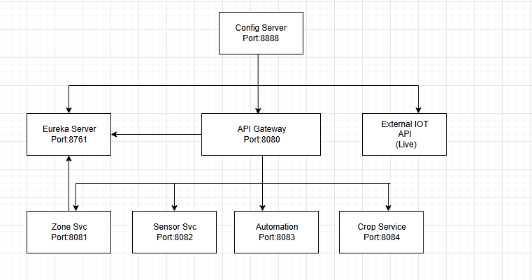
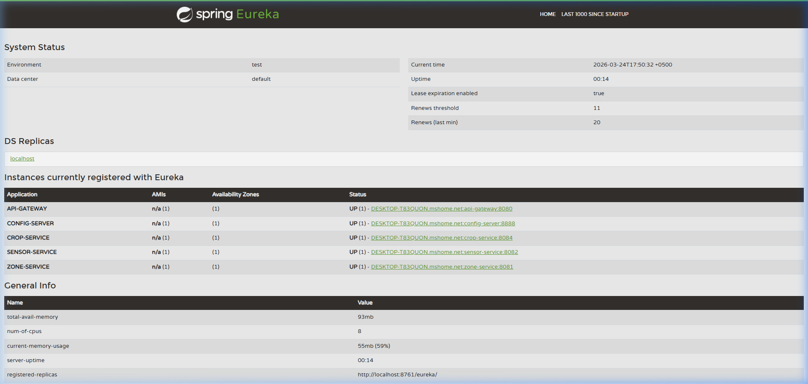
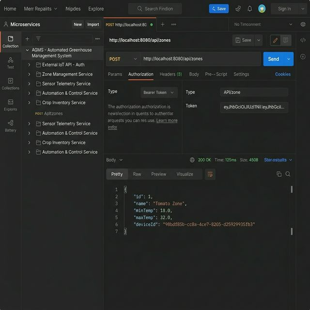
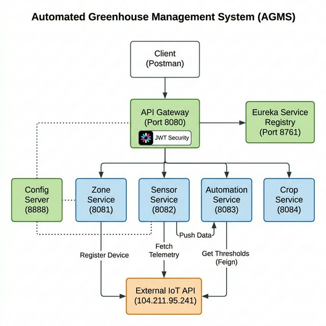

# **Automated Greenhouse Management System (AGMS)**

**Microservice-Based Application — ITS 2018 Final Examination**

---

## **📌 Project Overview**

The **Automated Greenhouse Management System (AGMS)** is a cloud-native, microservice-based platform designed to automate greenhouse operations using real-time environmental data.

The system integrates with an **external IoT API** to fetch live telemetry (temperature & humidity), processes it using a rule engine, and triggers automated actions to maintain optimal crop conditions.

---

## **Key Features**

* Microservices architecture using Spring Boot & Spring Cloud
* Service discovery using Eureka
* Centralized configuration via Config Server
* API Gateway with JWT-based authentication
* Real-time IoT data integration
* Automated rule-based decision engine
* Crop lifecycle management

---

## **System Architecture**



---

## **Technology Stack**

| Technology       | Purpose                        |
| ---------------- | ------------------------------ |
| Spring Boot      | Microservices development      |
| Spring Cloud     | Distributed system support     |
| Eureka           | Service discovery              |
| Config Server    | Centralized configuration      |
| API Gateway      | Routing + JWT security         |
| OpenFeign        | Inter-service communication    |
| RestTemplate     | Internal service communication |
| MySQL            | Database                       |
| JWT              | Authentication                 |
| External IoT API | Live telemetry                 |

---

## **📋 Prerequisites**

* Java 21+
* Maven 3.9+
* MySQL (XAMPP or standalone)
* Postman

---

## **🗄️ Database Setup**

1. Start MySQL using XAMPP
2. Default configuration:

```
Username: root  
Password: (empty)
```

3. Database will be auto-created:

```
AGMS_Db
```

---

## **⚙️ Configuration (Example: zone-service.yml)**

```yaml
server:
  port: 8081

spring:
  application:
    name: zone-service
  config:
    import: optional:configserver:http://localhost:8888
  datasource:
    url: jdbc:mysql://localhost:3306/AGMS_Db?createDatabaseIfNotExist=true
    username: root
    password: Ijse@1234
    driver-class-name: com.mysql.cj.jdbc.Driver
  jpa:
    hibernate:
      ddl-auto: update
    show-sql: true
    properties:
      hibernate:
        dialect: org.hibernate.dialect.MySQL8Dialect
        format_sql: true

eureka:
  client:
    register-with-eureka: true
    fetch-registry: true
    service-url:
      defaultZone: http://localhost:8761/eureka/
  instance:
    prefer-ip-address: true
```

---

## **⚙️ Centralized Configuration (Config Server)**

* All microservices act as Config Clients
* They fetch configuration from the Config Server at startup
* Configuration is stored in a centralized repository
* Enables dynamic updates without rebuilding services

---

## **🚀 Running the Application (IMPORTANT)**

Services must be started in the correct order due to dependencies (Config → Eureka → Gateway → Domain Services).

### Option 1: Run All Services (Recommended)

```powershell
.\start.ps1
```

Wait 2–3 minutes, then verify:
[http://localhost:8761](http://localhost:8761)

### Option 2: Run via IntelliJ IDEA (Manual)

Run services in the **exact order below**:

1. Config Server
2. Eureka Server
3. API Gateway
4. Zone Service
5. Sensor Service
6. Automation Service
7. Crop Service

---

## **📊 Eureka Dashboard Verification**

Open:
[http://localhost:8761](http://localhost:8761)

Expected status:

| Service            | Port | Status |
| ------------------ | ---- | ------ |
| CONFIG-SERVER      | 8888 | UP     |
| API-GATEWAY        | 8080 | UP     |
| ZONE-SERVICE       | 8081 | UP     |
| SENSOR-SERVICE     | 8082 | UP     |
| AUTOMATION-SERVICE | 8083 | UP     |
| CROP-SERVICE       | 8084 | UP     |

### Screenshot



> **Note:** Eureka Server does not register itself by default.

---

## **🔄 System Workflow (End-to-End)**

1. Zone Service creates a zone and registers IoT device

2. Sensor Service fetches live data every 10 seconds

3. Sensor Service sends data to Automation Service

4. Automation Service fetches thresholds from Zone Service

5. Rule engine triggers actions:

    * Temp > max → TURN_FAN_ON
    * Temp < min → TURN_HEATER_ON

6. Logs stored and available via API

---

## **🌡️ Scheduled Sensor Data Flow**

Sensor Service fetches telemetry data from the External IoT API every 10 seconds.
The data is sent to the Automation Service for rule processing.

### Example Request

```http
POST /api/automation/process
```

```json
{
  "zoneId": "Zone-A",
  "temperature": 23.81,
  "humidity": 55.09
}
```

### Rule Processing

* IF temperature > maxTemp → TURN_FAN_ON
* IF temperature < minTemp → TURN_HEATER_ON

Logs can be retrieved via:

```
GET /api/automation/logs
```

---

## **🔗 Inter-Service Communication**

* OpenFeign is used for synchronous communication between services

    * Example: Automation Service → Zone Service (to fetch temperature thresholds)
* RestTemplate is used for internal HTTP calls where required

---

## **🌐 API Endpoints (Gateway - Port 8080)**

### Zone Service

* POST `/api/zones`
* GET `/api/zones/{id}`
* PUT `/api/zones/{id}`
* DELETE `/api/zones/{id}`

### Sensor Service

* GET `/api/sensors/latest`

### Automation Service

* POST `/api/automation/process`
* GET `/api/automation/logs`

### Crop Service

* POST `/api/crops`
* PUT `/api/crops/{id}/status`
* GET `/api/crops`

---

## **🌱 Crop Lifecycle Rules**

The Crop Inventory Service enforces the following lifecycle transitions:

* SEEDLING → VEGETATIVE
* VEGETATIVE → HARVESTED
* Invalid transitions are rejected (e.g., HARVESTED → SEEDLING)

This ensures that crop status is always valid and consistent.

---

## **🔐 JWT Authentication Flow**

1. User registers/logs in via `/auth` endpoints
2. System returns JWT token
3. Client sends token in Authorization header
4. API Gateway validates the token
5. If valid → request routed to microservice
6. If invalid → 401 Unauthorized

---

## **🌍 External IoT Integration**

* Base URL:

```
http://104.211.95.241:8080/api
```

* Sensor Service fetches live telemetry
* Zone Service registers devices

---

## **🧪 Testing**

1. Open Postman
2. Import:

```json
postman/agms-postman-collection.json
```

3. Test services (8081–8084) and Gateway (8080 with JWT)

---

## **📸 Postman Testing Screenshots**

### Successful API Calls



### End-to-End System Workflow



---

## **📁 Project Structure**

```
AGMS/
├── ConfigServer/
├── Eureka_Server/
├── Api_Gateway/
├── ZoneService/
├── SensorService/
├── AutomationService/
├── CropService/
├── postman/
├── docs/
└── README.md
```

---

## ✅ Final Status

* All microservices are running successfully
* All services are registered in Eureka (UP status)
* External IoT integration is working correctly
* JWT security is implemented at API Gateway
* End-to-end data flow verified successfully


